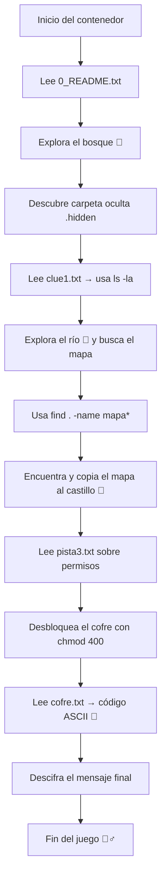

# 🧠 **Linux Quest — El Camino del Programador Feliz** 🐧

[](https://hub.docker.com/r/gperzal/linux-quest)
[](https://ubuntu.com/)
[](https://www.gnu.org/software/bash/)
[]()
[](LICENSE)

---

## 🧭 **Descripción general**

**Linux Quest** es una experiencia educativa interactiva creada dentro de un contenedor Docker.  
Su objetivo es enseñar los **comandos esenciales de Linux** de manera práctica y lúdica, a través de una historia guiada dentro del terminal.

Los estudiantes se convierten en aventureros dentro del “Reino del Código” 🧙‍♂️,  
donde deben superar desafíos técnicos —como navegar directorios, descubrir archivos ocultos o cambiar permisos— para desbloquear el mensaje final secreto.

---

## 🎓 **Propósito educativo**

Este proyecto fue diseñado para:
- Enseñar **comandos básicos de Linux** en un entorno seguro (contenedor).
- Desarrollar la **curiosidad, exploración y resolución de problemas** en los estudiantes.
- Fomentar el **aprendizaje activo y experiencial** a través de la gamificación.
- Integrar la práctica con conceptos teóricos: permisos, estructura de archivos, visibilidad y control de acceso.

💡 Es ideal para usar en:
- Bootcamps de desarrollo web o sistemas.
- Cursos de introducción a Linux.
- Actividades colaborativas o desafíos en clase.

---

## 🧩 **Historia del juego**

> “En el Reino del Código, un joven programador busca el Camino de la Felicidad.  
> Para lograrlo, deberá superar pruebas, descifrar pistas y dominar la terminal.”

A través de comandos reales (`ls`, `cd`, `chmod`, `cat`, `find`, etc.),  
el estudiante explora zonas del mundo virtual:
- 🌲 **El Bosque** (`forest`)
- 🌊 **El Río** (`river`)
- 🏰 **El Castillo** (`castle`)
- 🕳️ **La Cueva Secreta** (`.cave`)

Cada zona contiene **archivos ocultos y pistas** que guían la aventura hasta el cofre final.

---

## 🗺️ **Flujo del juego (diagrama Mermaid)**



---

## ⚙️ **Tecnologías utilizadas**

| Tecnología | Descripción |
|-------------|--------------|
| 🐳 **Docker** | Permite encapsular la experiencia en un contenedor portable y seguro. |
| 🐧 **Ubuntu 24.04** | Sistema base del entorno Linux. |
| 🧩 **Bash scripting** | Automatiza la creación de archivos, pistas y estructura del juego. |
| 🔠 **ASCII encoding** | Usado como método de cifrado educativo para el mensaje final. |
| 🎓 **Gamificación educativa** | Enfoque pedagógico para promover el aprendizaje activo. |

---

## 🚀 **Cómo jugar**

1️⃣ Descarga y ejecuta la imagen:  
```bash
docker run -it --name linux-quest gperzal/linux-quest:1.3
```

2️⃣ Dentro del contenedor:  
```bash
cd quest
cat 0_README.txt
```

3️⃣ Explora el entorno y sigue las pistas.  
4️⃣ Usa los comandos de Linux para encontrar el cofre final.  
5️⃣ Descifra el mensaje secreto en código ASCII 🔢  

> ¡A jugar!

---

## 💀 **Historia reciente: El Bug del Reino**

En una actualización misteriosa, un *Bug malvado* atacó el sistema y **borró las instrucciones originales** del juego 🧟‍♂️  
Los estudiantes deben reconstruir parte de los pasos perdidos para completar la misión.

> “El Bug creyó borrar el conocimiento… pero solo fortaleció tu ingenio.”


---

## 🧰 **Estructura del proyecto**

```
linux-quest/
├── Dockerfile
├── entrypoint.sh
├── assets/
│   └── STORY.txt
└── README.md
```

---

## 🧱 **Versión del proyecto**

| Versión | Estado | Descripción |
|----------|----------|-------------|
| `1.0` | 🚧 Inicial | Versión base del entorno, pruebas locales. |
| `1.1` | 🔧 Fix | Corrección de formato CRLF y permisos. |
| `1.2` | ⚙️ Estable | Conversión `dos2unix` y compatibilidad multiplataforma. |
| `1.3` | 🚀 Actual | Versión educativa final con narrativa “El Bug”. |

> 🏷️ **Imagen oficial:** `gperzal/linux-quest:1.3`  
> 💡 *Alias:* `gperzal/linux-quest:latest`

---

## 🧪 **Evaluación educativa sugerida**

| Criterio | Nivel Básico | Nivel Medio | Nivel Avanzado |
|-----------|---------------|-------------|----------------|
| Navegación | Usa `cd`, `ls`. | Usa `ls -la` y rutas relativas. | Usa `tree` y rutas absolutas. |
| Búsqueda | Encuentra archivos. | Usa `find` o `grep`. | Combina comandos (`|`, `>`, `>>`). |
| Permisos | Cambia permisos básicos. | Usa octales (`400`, `755`). | Explica bits de ejecución y grupos. |
| Resolución | Sigue pistas textuales. | Descifra ASCII. | Encuentra la carpeta secreta. |

---

## 💡 **Aprendizajes esperados**

Al completar el juego, el estudiante será capaz de:

- Comprender la estructura de archivos en Linux.  
- Usar comandos básicos y de búsqueda.  
- Manejar permisos con `chmod`.  
- Entender el flujo de lectura y ejecución en terminal.  
- Aplicar razonamiento lógico y curiosidad técnica.  

---

## 👨‍🏫 **Autor y propósito**

Proyecto creado por **Guido Pérez Zelaya** 🎓  
Creado para los estudiantes de de *Generation Chile, Full Stack Java Developer Bootcamp*  

> 🧩 “Linux Quest” es un entorno educativo diseñado para motivar el aprendizaje activo en entornos CLI,  
> fomentando la exploración, la autonomía y el pensamiento crítico en la enseñanza de sistemas operativos.

---

## 📜 **Licencia**

Este proyecto se distribuye bajo la licencia **MIT**.  
Eres libre de usarlo, modificarlo y adaptarlo con fines educativos.

---

## 🖼️ **Créditos visuales**

Ilustración “El Bug del Reino” creada para uso educativo por Guido Pérez.  
Inspiración: *Aprender jugando también se hace en la terminal.*
